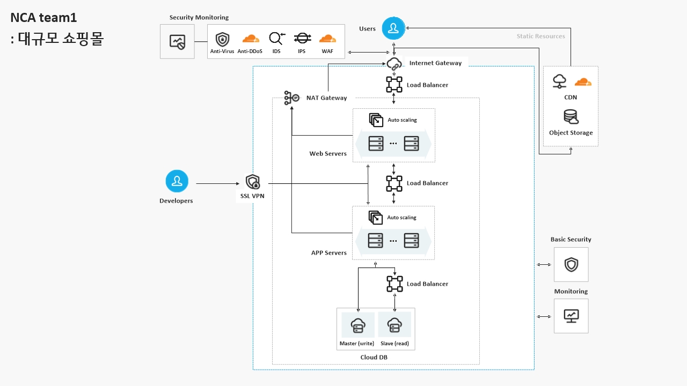

# uos-nca-project
서울시립대학교 네이버클라우드아카데미 Literacy 1기 (1조 Project)

## 📖 프로젝트 개요

본 프로젝트는 네이버 클라우드 아카데미(NCA) 1기 과정에서 학습한 내용을 바탕으로 클라우드 아키텍처를 직접 설계하고 구현해보는 실증 프로젝트입니다.

애플리케이션 코드 자체의 복잡성보다는, 컨테이너화된 웹 서비스를 클라우드 환경에 배포하고 운영하는 전체적인 흐름을 이해하는 데 중점을 두었습니다.

## 🏛️ 시스템 아키텍처



본 프로젝트는 위 아키텍처 다이어그램과 같이 3-Tier 아키텍처를 기반으로 구성되어 있습니다.

## 🧩 주요 구성 요소

- **React Client (`/react_client`)**
  - 사용자 인터페이스(UI)를 제공하는 프론트엔드 웹 애플리케이션입니다. (Presentation Tier)
  - React로 개발되었으며, Nginx 웹 서버를 통해 정적 파일로 서비스됩니다.
  - `Dockerfile.client`를 통해 컨테이너 이미지로 빌드됩니다.

- **Node.js Server (`/node_server`)**
  - 비즈니스 로직을 처리하는 백엔드 API 서버입니다. (Application Tier)
  - Node.js (Express)로 개발되었습니다.
  - `Dockerfile.server`를 통해 컨테이너 이미지로 빌드됩니다.

- **MySQL Database (`/node_server/mysql_db`)**
  - 데이터를 저장하는 관계형 데이터베이스입니다. (Data Tier)
  - `init.sql`을 통해 초기 테이블 및 데이터가 설정됩니다.
  - `Dockerfile.db`를 통해 컨테이너 이미지로 빌드됩니다.

- **CI/CD (`.github/workflows/github-ci.yml`)**
  - GitHub Actions를 사용하여 코드 변경 시 자동으로 테스트 및 빌드를 수행하는 CI 파이프라인이 구성되어 있습니다.

## 🚀 시작하기

> [!NOTE]
> 로컬 환경에서 실행하기 위해서는 Docker와 Docker Compose가 설치되어 있어야 합니다.

1.  **프로젝트 클론**
    ```bash
    git clone https://github.com/your-username/uos-nca-project.git
    cd uos-nca-project
    ```
    (your-username을 실제 GitHub 사용자 이름으로 변경하세요)

2.  **Docker Compose 실행**
    아래 명령어를 실행하여 모든 서비스를 한 번에 실행합니다. (`-d` 옵션은 백그라운드 실행을 의미합니다.)
    ```bash
    docker-compose up -d --build
    ```

3.  **애플리케이션 접속**
    -   **프론트엔드:** [http://localhost:3000](http://localhost:3000)
    -   **백엔드 API:** `http://localhost:8080`

## 🐳 Dockerization

각 서비스(Client, Server, DB)는 개별 `Dockerfile`을 통해 컨테이너화되어 있으며, `docker-compose.yml` 파일을 통해 통합적으로 관리됩니다. 이를 통해 개발 환경과 프로덕션 환경의 일관성을 유지하고, 배포를 용이하게 합니다.